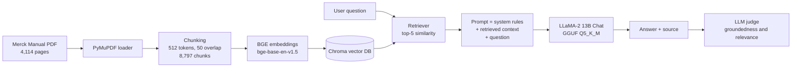

# RAG Healthcare Assistant: Medical Q&A over the Merck Manual

A Retrieval-Augmented Generation (RAG) prototype that answers clinical questions using the **Merck Manual** (4,114 pages) and compares the result with a **prompt-engineering-only** baseline. The pipeline runs on an open-source **LLaMA-2 13B Chat** model, so it needs no paid API.


> **Disclaimer:** This is an educational prototype. It is not a medical device and must not be used for diagnosis or treatment decisions. Always verify answers against the original source and clinical judgement.

---

## Table of Contents
1. [Problem Statement](#problem-statement)
2. [Objective](#objective)
3. [How It Works](#how-it-works)
4. [Tech Stack](#tech-stack)
5. [Dataset](#dataset)
6. [Key Results](#key-results)
7. [Getting Started](#getting-started)
8. [Repository Structure](#repository-structure)
9. [Known Limitations](#known-limitations)
10. [Future Work](#future-work)
11. [Author](#author)

---

## Problem Statement

Healthcare professionals face information overload: large volumes of research and reference material must be searched quickly to reach an accurate diagnosis or treatment plan, especially in emergencies. This project explores whether an AI assistant that retrieves evidence from a trusted manual can give faster, source-based answers than a language model working from memory alone.

The assistant is tested on four questions:

| # | Domain | Question |
|---|--------|----------|
| 1 | Critical care | What is the protocol for managing sepsis in a critical care unit? |
| 2 | General surgery | What are the common symptoms of appendicitis, can medicine cure it, and if not, which surgical procedure is used? |
| 3 | Dermatology | What treatments and causes exist for sudden patchy hair loss (localized bald spots)? |
| 4 | Neurology | What treatments are recommended after a physical injury to brain tissue that impairs brain function? |

## Objective

- **Understand** the information-overload problem in healthcare.
- **Apply** RAG to retrieve evidence from a medical manual.
- **Analyze** how retrieval changes answer quality compared with prompt engineering alone.
- **Evaluate** answers with an LLM-as-judge on *groundedness* and *relevance* (1-5).
- **Create** a working prototype that demonstrates feasibility.

## How It Works



**Two approaches are compared:**

1. **Prompt engineering only:** the model answers from its own memory using a role + rules prompt.
2. **RAG:** the model answers only from the 5 most similar manual chunks and must reply *"Sorry, this is out of my knowledge base."* when the context does not help.

## Tech Stack

| Layer | Tools |
|-------|-------|
| Language | Python |
| LLM | LLaMA-2 13B Chat (GGUF, Q5_K_M) via `llama-cpp-python` (GPU) |
| Orchestration | LangChain |
| PDF loading | PyMuPDF (PyPDF also imported) |
| Chunking | `RecursiveCharacterTextSplitter` with tiktoken |
| Embeddings | `BAAI/bge-base-en-v1.5` (Hugging Face, normalized) |
| Vector store | ChromaDB (persisted) |
| Evaluation | LLM-as-judge (groundedness, relevance) with pandas |
| Environment | Google Colab / Jupyter Notebook (GPU runtime) |

## Dataset

The **Merck Manual** (medical diagnosis and therapy reference, 23 sections, 4,114 pages once loaded). The PDF is **not included** in this repository because of copyright. Obtain it legally and place it at the path set in the notebook.

## Key Results

| Setup | Groundedness (mean) | Relevance (mean) | Time per answer |
|-------|:------------------:|:----------------:|:---------------:|
| Prompt engineering only | 4.75 | 4.75 | about 2-6 s |
| RAG (top-5 chunks) | 4.75 | 4.25 | about 22-52 s |

Per-question scores (groundedness / relevance):

| Question | Prompt only | RAG |
|----------|:-----------:|:---:|
| Sepsis protocol | 5 / 5 | 5 / 5 |
| Appendicitis | 5 / 5 | 4 / 4 |
| Patchy hair loss | 4 / 4 | 5 / 4 |
| Brain injury | 5 / 5 | 5 / 4 |

**How to read these numbers**

- **RAG answers are clearly better when read by hand.** They give step-by-step protocols (for example a nine-step sepsis protocol) and cover every part of multi-part questions. The prompt-only answers stop after one opening sentence.
- **The automatic scores do not show that gap.** The baseline answers are truncated by a `"\n"` stop sequence, and the same 13B model generates and grades the answers, which makes the judge lenient and inconsistent. Treat the scores as a rough guide, not proof.
- **Trade-off:** RAG is slower because each prompt carries roughly 2,600-3,600 tokens of retrieved text, close to the 4,096-token context limit.

## Getting Started

### Prerequisites
- Google Colab (GPU runtime) or a machine with a CUDA GPU
- A Hugging Face account (for the model download)
- The Merck Manual PDF (not provided)

### Run in Google Colab
1. Open `RAG_Healthcare_Assistant.ipynb` in Colab and select a **GPU** runtime.
2. Run the install cells, then **restart the runtime** when asked.
3. Upload the Merck Manual PDF to Google Drive and update `pdf_path` in the notebook:
   ```python
   pdf_path = "/content/drive/MyDrive/Dataset/GenAIDataset/medical_diagnosis_manual.pdf"
   ```
4. Run all cells in order. The first run builds the Chroma database (slowest step) and saves it to Drive so later runs can reload it.

### Main dependencies (pinned in the notebook)
```
langchain==0.3.27
langchain_community==0.3.27
chromadb==1.0.15
pymupdf==1.26.3
tiktoken==0.9.0
sentence-transformers==3.4.1
transformers==4.49.0
huggingface_hub==0.20.3
llama-cpp-python==0.2.45   # built with CUDA support
```

### Ask your own question
```python
answer = generate_rag_response(
    user_input="What is the protocol for managing sepsis in a critical care unit?",
    retriever=retriever,
    system_message=medical_system_message,
    user_message_template=medical_user_message_template,
)
print(answer)
```

## Repository Structure

```
rag-healthcare-assistant/
├── RAG_Healthcare_Assistant.ipynb   # full pipeline: baseline, RAG, evaluation
├── README.md
├── requirements.txt                 # optional: pinned dependencies
├── .gitignore                       # exclude PDF, model files and vector DB
└── docs/                            # optional: screenshots, architecture image
```

Add these lines to `.gitignore` so large or copyrighted files are not uploaded:
```
*.pdf
*.gguf
rag_healthcare_llm/
.ipynb_checkpoints/
```

## Known Limitations

- Citations show only the PDF file path; the page number is in the metadata but is not passed to the model, so answers cannot cite exact pages yet.
- The baseline response function stops at the first line break, which truncates its answers.
- The LLM judge is the same 13B model as the generator and sometimes ignores the requested format.
- Only four questions were tested; there are no gold reference answers or clinician review.
- The context window (4,096 tokens) is nearly full with five 512-token chunks.
- Front-matter and non-clinical pages of the PDF are also indexed.

## Future Work

- Add page and section numbers to the context for true citations.
- Improve retrieval with a re-ranker, hybrid BM25 + vector search, MMR and section-level metadata filters.
- Evaluate with RAGAS, gold answers and clinician review; use a stronger judge model.
- Compare other open models (for example 7B-8B models) and embedding models.
- Build a Streamlit or Gradio interface and deploy it on Hugging Face Spaces.
- Add conversation memory, source highlighting and out-of-scope safety tests.

## Author

**S. Kalaiyarasan**
BSc Information Technology, RVS College of Arts and Science, Sulur, Coimbatore

- GitHub: `<your-github-link>`
- LinkedIn: `<your-linkedin-link>`

## Acknowledgements

- Merck Manuals for the medical reference content
- Meta (LLaMA-2), TheBloke (GGUF quantization), BAAI (BGE embeddings)
- LangChain, ChromaDB and Hugging Face open-source communities

## License

Code: add a license of your choice (for example MIT). The LLaMA-2 model is subject to Meta's Llama 2 Community License, and the Merck Manual content remains the property of its publisher.
